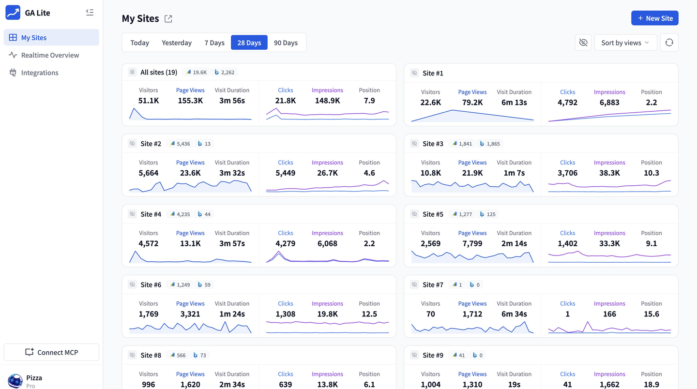

# GA Lite

[English](./README.md) | 简体中文 | [日本語](./README.ja.md)



本仓库是 [GA Lite](https://galite.io/) 的开源版本，产品功能与 galite.io 相同，运行于 Cloudflare Workers 和 D1。

- 开源仓库：[github.com/crevanta/galite](https://github.com/crevanta/galite)
- 开源协议：[AGPL-3.0-only](./LICENSE)

## 功能

- 连接多个 Google Analytics 4、Google Search Console 和 Bing Webmaster 账号。
- 在一个面板中管理多个站点。
- 查看概览、实时、趋势、维度和漏斗报告。
- 按需发布公共主页和可嵌入的 Widget。
- 通过 HTTP API 和 MCP 聚合站点数据。

## 准备条件

- 一个 [Cloudflare](https://dash.cloudflare.com/) 账号。
- Node.js 20.19.6+（20.x）或 22.12+（22.x），以及 pnpm 9.15.9。如果系统没有 `pnpm`，可执行 `npm install -g pnpm@9.15.9` 安装。

## 部署

### 1. 安装依赖并创建 D1

```bash
pnpm install
pnpm exec wrangler login
pnpm exec wrangler d1 create open-galite
cp wrangler.jsonc.example wrangler.jsonc
```

将命令返回的 D1 `database_id` 填入 `wrangler.jsonc`。此时不需要配置域名、管理员账号或 Google OAuth。

### 2. 部署 Worker

```bash
pnpm build
openssl rand -hex 32 | pnpm exec wrangler secret put APP_SECRET
pnpm db:migrate:remote
pnpm exec wrangler deploy
```

`APP_SECRET` 是部署时唯一必需的 Secret。部署完成后，Wrangler 会输出生成的 `workers.dev` 访问地址。

### 3. 初始化管理员

打开部署地址。首次访问会要求设置管理员邮箱和密码，完成后自动登录。

## 可选配置

### Google Analytics 与 Search Console

应用运行后再配置 Google OAuth。下面的操作应始终在同一个 Google Cloud 项目中完成。

1. 打开 [Google Cloud 项目创建页](https://console.cloud.google.com/projectcreate)，为 GA Lite 创建一个项目，并在控制台中选中该项目。
2. 打开 [API Library](https://console.cloud.google.com/apis/library)，分别搜索并启用：
   - **Google Analytics Admin API**（`analyticsadmin.googleapis.com`）
   - **Google Analytics Data API**（`analyticsdata.googleapis.com`）
   - **Google Search Console API**（`searchconsole.googleapis.com`）

   已登录 Google Cloud CLI 的 AI Agent 也可以执行：

   ```bash
   gcloud services enable \
     analyticsadmin.googleapis.com \
     analyticsdata.googleapis.com \
     searchconsole.googleapis.com \
     --project YOUR_PROJECT_ID
   ```

3. 打开 [Google Auth Platform scopes](https://console.cloud.google.com/auth/scopes)。如果首次进入时要求完善应用信息，应用名称填写 **GA Lite**，填写支持邮箱和开发者联系邮箱；个人 Gmail 账号的 Audience 选择 **External**。进入 **Data Access**，点击 **Add or remove scopes**，搜索并勾选下面全部权限，然后保存：

   ```text
   https://www.googleapis.com/auth/webmasters
   https://www.googleapis.com/auth/webmasters.readonly
   https://www.googleapis.com/auth/analytics
   https://www.googleapis.com/auth/analytics.edit
   https://www.googleapis.com/auth/analytics.readonly
   https://www.googleapis.com/auth/userinfo.email
   https://www.googleapis.com/auth/userinfo.profile
   openid
   ```

4. 在已经部署的 GA Lite 中打开 **设置 → Google OAuth**，复制页面显示的 **已获授权的 JavaScript 来源**和两个**已获授权的重定向 URI**。
5. 打开 [Google Auth Platform clients](https://console.cloud.google.com/auth/clients)，点击 **Create client**，应用类型选择 **Web application**：
   - 在 **Authorized JavaScript origins** 中添加 GA Lite 显示的来源；这里只能填写 Origin，不能包含路径。
   - 在 **Authorized redirect URIs** 中分别添加 GA4 和 GSC 回调地址，必须与 GA Lite 显示的内容完全一致。
6. 创建 Client，复制得到的 **Google Client ID** 和 **Google Client Secret**，填入 **设置 → Google OAuth** 并保存。
7. 打开 **数据集成 → 添加新账号**，完成 Google 授权。

如果还没有配置 Google Client，点击 **添加新账号** 会自动打开对应的设置页。

### Bing Webmaster

打开 **数据集成 → 添加新账号**，选择 Bing，然后填写 Bing Webmaster API Key。

### 自定义域名

默认生成的 `workers.dev` 地址可以直接使用。需要自定义域名时：

1. 在 Cloudflare 中为 Worker 绑定域名。
2. 通过该自定义域名打开 GA Lite，再进入 **设置 → 自定义域名**，填写该域名的 HTTPS Origin。
3. 如果已经启用 Google OAuth，请按设置页显示的新地址同时更新 Google Cloud 中的 JavaScript 来源和授权回调地址。

自定义域名留空时，GA Lite 会自动使用当前请求的 Origin。

## API 与 MCP

所有入口都使用当前部署的 Origin：

- API 文档：`/api-docs`
- MCP 入口：`/api/mcp`
- MCP OAuth 元数据：`/.well-known/oauth-authorization-server`

## 本地开发

创建 `.dev.vars`，只需写入一个本地 Secret：

```dotenv
APP_SECRET=replace-with-at-least-32-random-characters
```

然后准备本地 D1 并启动 Nuxt：

```bash
pnpm db:migrate:local
pnpm dev
```

打开终端输出的本地地址，按相同流程初始化管理员。

## 更新已有部署

拉取新版本后执行：

```bash
pnpm install
pnpm db:migrate:remote
pnpm deploy
```

## 开源协议

GA Lite 使用 [GNU Affero General Public License v3.0](./LICENSE) 发布。
